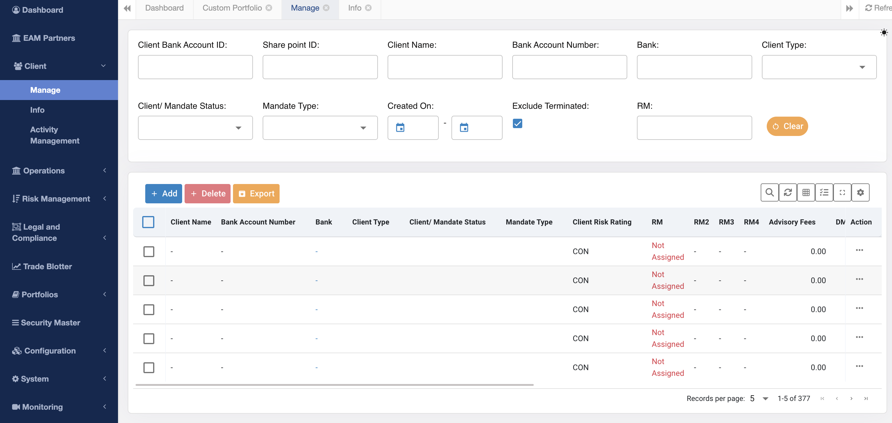
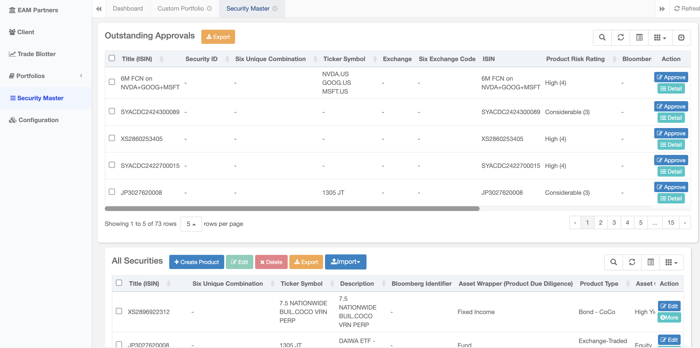

## Our Philosophy

We believe that it is one thing to receive guidance and advice, but finding and  implementing a suitable solution is another.

Our system is the culmination of nearly a decade of experience implementing a wide variety of systems and solutions for asset managers, brokers, research analysts and corporate finance advisers.

It is built on architecture, which is customisable and flexible and covers a wide variety of areas.

We combine tools and frameworks as well as advice which ties together the whole range of areas such as compliance to accounting to operations into a holistic system.

New tools and processes are being added all the time so remember to check back in regularly!

## Tools

Below are a summary of the tools used in our system.

All tools are used within a process.

### Trade Blotter

The trade blotter is used to record all the orders sent to a broker.

It is typically used to implement pre-trade controls such as trade reconciliation and perform other functions like calculate commissions.

Trades are input whenever they are executed and may be sorted and filtered according to the their date, clients, asset class etc.

### Client Database

The client database contains information of the client, which will be fed into the trade blotter, used to generate risk reports and perform AML.&#x20;

### Securities Master Database

The security master database contains all the securities traded, together with  internally generated data such as risk ratings and approval status.

<Frame caption="Display of Securities Being Approved">
  
</Frame>

It is used to generate risk and client reports.