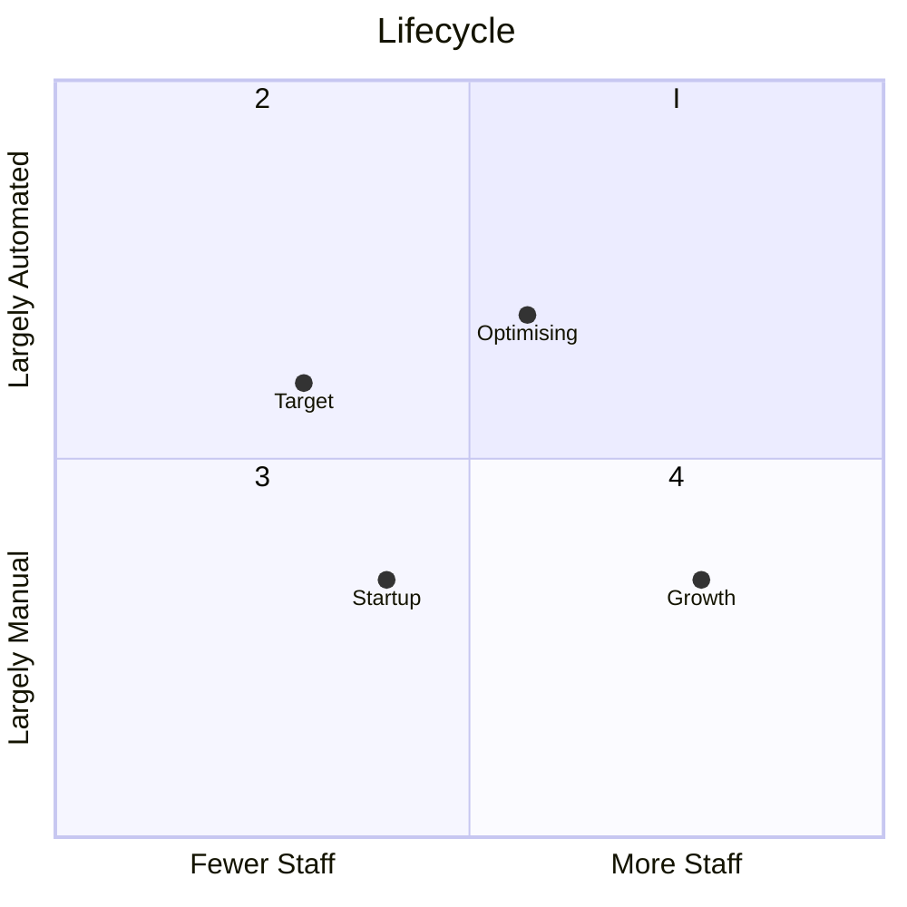

## Introduction

Our services are designed to minimise the cost and effort required to implement controls through a combination of technology and onsite and offsite resources.

We are able to scale our support to fit the resource resources available to our clients. 

For example, we are able to carry out daily functions on our own or together with client staff, depending on where you are in the company's life cycle.

## Examples

We provide a wide range of middle office services ranging from trade reconciliation to compliance monitoring and accounting.

Below are some of the projects we regularly perform:
- daily PNL calculations
- daily position and trade reconciliations
- organising senior management meetings
- monitoring personal account dealing
- providing compliance training
- updating policies and procedures

## Methodology

These services utilise our tools and frameworks.
