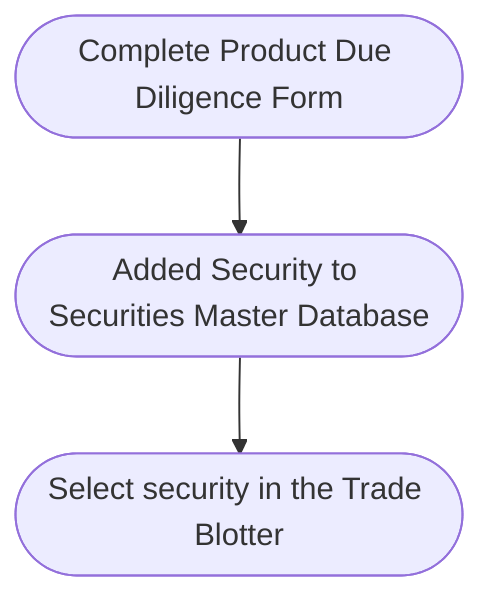

## Trading

### Product Due Diligence

Prior to trading, it may be necessary to perform due diligence, especially on complex products. This is performed by way of a due diligence form.

Securities are added to the Securities Master Database upon completion of the product due diligence form.

The due diligence form can be customised to include due diligence fields such as the country of issue, risk ratings and product characteristics.

### Approval

Once the product due diligence form is completed, it can be sent to senior management for approval prior to trading.

Upon approval, the security will be added to the database and become available for inclusion in the  trade blotter.

## Trading

### Set up Pre-Trade Approvals

Pre-trade approvals should also be set prior to trading. They are parameters which determine whether trades need pre-approval and obtain their parameters from the Due Diligence Form.&#x20;

Examples of some of the available parameters are:

* Client Risk Rating

* Mandate Type

* Asset Class

* Asset Wrapper

* Buy/Sell

* Solicited / Unsolicited

/

### Create Portfolio

Portfolios should be created before trades are input in the trade blotter.

<Frame caption="Custom Portfolio">
  
</Frame>

### 2. Inputting Orders

When entering orders, it is necessary to select the client.

Trades can be separated into Open and Executed Trades

<Frame caption="Open Orders and Executed Trades">
  
</Frame>

Please