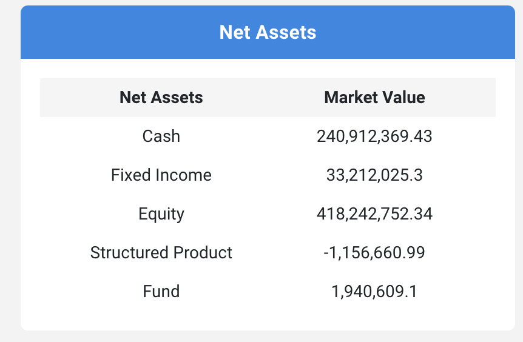

## Why use this system?

This system is developed to comply with regulatory requirements applicable to firms licensed by the Securities and Futures Commission in Hong Kong.

It provides various compliance-related facilities such as client onboarding, trade approvals, training and client reporting.

## Trade Blotter

### Introduction

The trade blotter is used to record all the orders sent to a broker.

It is typically used to implement pre-trade controls such as trade reconciliation and perform other functions like calculate commissions.

Trades are input whenever they are executed and may be sorted and filtered according to the their date, clients, asset class etc.

### Securities Master Database

The security master database contains all the securities traded, together with  internally generated data such as risk ratings and approval status.

It is used to generate risk and client reports.

## Pre-trade Controls

### 1. Product Due Diligence

Prior to trading, it may be necessary to perform due diligence, especially on complex products. This is performed by way of a due diligence form.

Securities are added to this database before they are traded by filling in a due diligence form.

The due diligence form can be customised to include due diligence fields such as the country of issue, risk ratings and product characteristics.

Approvals will be logged in the database.
Securities can be created by completing the product due diligence form.

### 2. Product Approval

Once the product due diligence form is completed, it can be sent to senior management for approval prior to trading.

Upon approval, the security will be added to the database and become available for inclusion in the  trade blotter.

## Client Statement

### Introduction
The client statement aggregates all the positions held across all custodians and shows the information in various graphical charts. 

It feeds from the 'Holdings' and 'Transactions' databases whenever the are updated. 

This section of the Client Statement shows the assets excluding loans.

### Distribution Charts

Distribution charts show the allocation of assets according to various metrics such as country, asset wrapper, risk rating etc.

The formula used to calculate this is: 'metric / denominator'. Examples of metrics are: 'country', 'risk rating', as you can see in the statements.

The denominator used is 'Total Assets'.

## Data Input

### Loans

Securities Master Database: Loans are identified under 'Asset Class' in the securities master database.

Client Statement: They are excluded from the client statement's distribution pie charts.