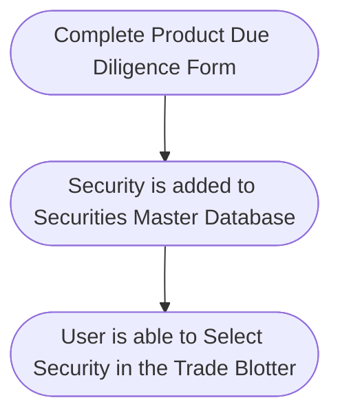

## Securities Master Database

The security master database contains all the securities traded, together with  internally generated data  such as risk ratings and approval status.

It is used to generate risk reports as well as implement pre-trade controls.

## Pre-trade Controls

### 1. Product Due Diligence

Prior to trading, it may be necessary to perform due diligence, especially on complex products. This is performed by way of a due diligence form.

Securities are added to this database before they are traded by filling in a due diligence form.

The due diligence form can be customised to include due diligence fields such as the country of issue, risk ratings and product characteristics.

Approvals will be logged in the database.
Securities can be created by completing the product due diligence form.

