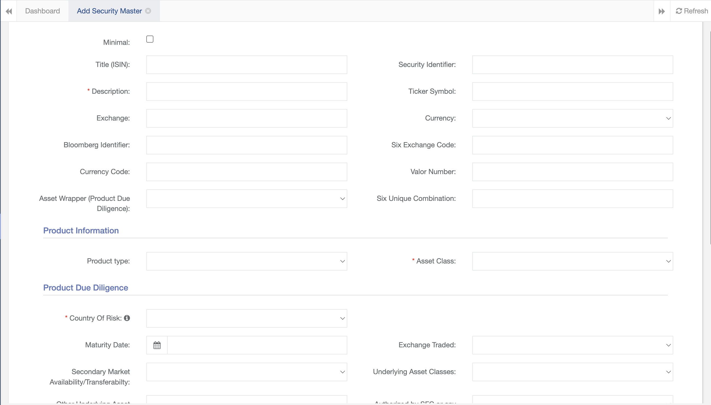

## Why Use This System?

This system is developed to comply with regulatory requirements applicable to firms licensed by the Securities and Futures Commission in Hong Kong.

It provides various compliance-related facilities such as client onboarding, trade approvals, training and client reporting.

## Trading Process

### Introduction

The trade blotter is used to record all the orders sent to a broker.

It is typically used to implement pre-trade controls such as trade reconciliation and perform other functions like calculate commissions.

Trades are input whenever they are executed and may be sorted and filtered according to the date, clients, asset class etc.

## Key Databases

The system uses multiple databases. These are: the securities master database, the transaction database and the holding database.&#x20;

### Securities Master Database

The security master database contains all the securities traded, together with  internally generated data such as risk ratings and approval status.

It is used to generate risk and client reports and is linked to by other databases such as the Transaction Database and Holdings Database.

### Transaction Database

The transaction database contains all the transactions executed by the firm. These are typically transactions recorded from bank or brokerage statements.

### Holdings Database

The holdings database contains all the holdings of the firm and typically recorded from bank or brokerage statements.

```mermaid
  flowchart LR
    Subgraph Transactions and Holdings
    Transaction Database
    Holdings Database
    end
    Securities Master Database --> Transactions and Holdings
```

## Product Due Diligence Process

Prior to trading, it may be necessary to perform due diligence, especially on complex products. This is performed by way of completing a due diligence form.

The due diligence form is typically customised to fit the needs of the firm and can include due diligence fields such as the country of issue, risk ratings and product characteristics.

Completing this form will upload the product into the securities master database for later use.

<Steps>
  <Step title="Step 1: Product Due Diligence" icon="notebook" stepNumber="1">
    Securities can be created by completing the product due diligence form.
  </Step>

  <Step title="Step 2: Securities Master Database " icon="database" stepNumber="2">
    Products input into the form will be added to the Securities Master Database.
  </Step>

  <Step title="Step 3: Approval" icon="thumbs-up" stepNumber="3">
    Products can be sent to senior management for approval prior to trading.
  </Step>

  <Step title="Step 4: Trade Blotter" icon="arrow-trend-up" stepNumber="4">
    User is now able to select the security in the Trade Blotter to input trades
  </Step>
</Steps>

Approvals will be logged in the database.
Securities can be created by completing the product due diligence form.



## Client Statement Facility

### Introduction

The client statement aggregates all the positions held across all custodians and shows the information in various graphical charts.

It feeds from the 'Holdings' and 'Transactions' databases whenever the are updated.


This section of the Client Statement shows the assets excluding loans.

### Distribution Charts

Distribution charts show the allocation of assets according to various metrics such as country, asset wrapper, risk rating etc.

The formula used to calculate this is: 'metric / denominator'. Examples of metrics are: 'country', 'risk rating', as you can see in the statements.

The denominator used is 'Total Assets'.

## Inputting Data

### Loans

Securities Master Database: Loans are identified under 'Asset Class' in the securities master database.

Client Statement: They are excluded from the client statement's distribution pie charts.