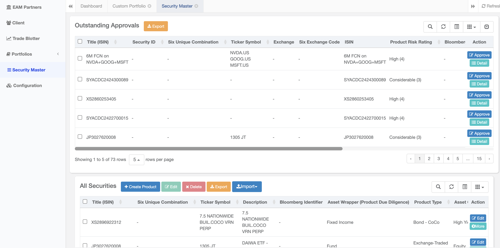
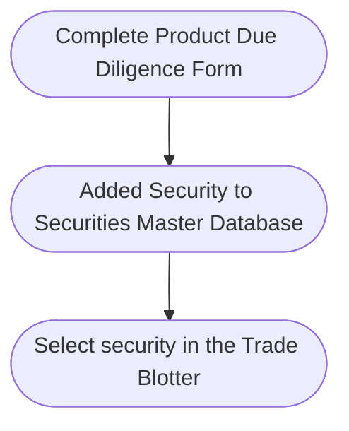
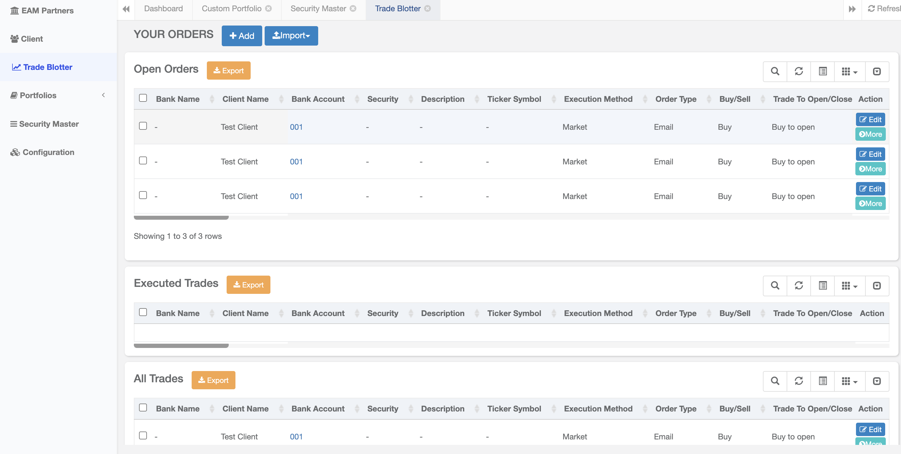
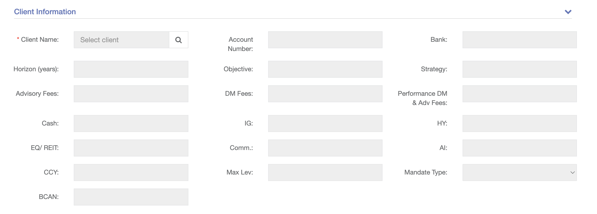

## The Trade Blotter

The trade blotter is used to record all the orders sent to a broker.

It is typically used to implement pre-trade controls such as trade reconciliation and perform other functions like calculate commissions.

Trades are input whenever they are executed and may be sorted and filtered according to the their date, clients, asset class etc.

### Client Database

The client database contains risk information of the client, which will be fed into the trade blotter.&#x20;

### Securities Master Database

The security master database contains all the securities traded, together with  internally generated data such as risk ratings and approval status.

<Frame caption="Display of Securities Being Approved">
  
</Frame>

It is used to generate risk and client reports.

## Pre-Trading

### 1. Portfolio

Portfolios should be created before trades are input in the trade blotter.

<Frame caption="Custom Portfolio">
  
</Frame>

### 2. Product Due Diligence

Prior to trading, it may be necessary to perform due diligence, especially on complex products. This is performed by way of a due diligence form.

Securities are added to this database before they are traded by filling in a due diligence form.

The due diligence form can be customised to include due diligence fields such as the country of issue, risk ratings and product characteristics.

Approvals will be logged in the database.
Securities can be created by completing the product due diligence form.

### 2. Approval

Once the product due diligence form is completed, it can be sent to senior management for approval prior to trading.

Upon approval, the security will be added to the database and become available for inclusion in the  trade blotter.

## Trading

### 3. Open Orders vs Executed Orders

Trades can be separated into Open and Executed Trades

<Frame caption="Open Orders and Executed Trades">
  
</Frame>

When entering orders, it is necessary to select the client.

