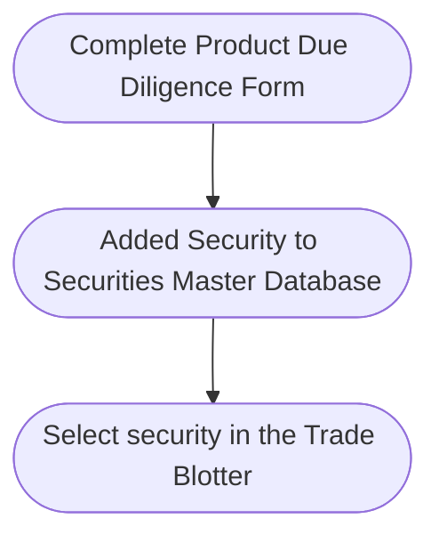

## Trading

### 1. Product Due Diligence

Prior to trading, it may be necessary to perform due diligence, especially on complex products. This is performed by way of a due diligence form.

Securities are added to this database before they are traded by filling in a due diligence form.

The due diligence form can be customised to include due diligence fields such as the country of issue, risk ratings and product characteristics.

Approvals will be logged in the database.
Securities can be created by completing the product due diligence form.

### 2. Approval

Once the product due diligence form is completed, it can be sent to senior management for approval prior to trading.

Upon approval, the security will be added to the database and become available for inclusion in the  trade blotter.

## Trading

### 1. Portfolio

Portfolios should be created before trades are input in the trade blotter.

<Frame caption="Custom Portfolio">
  
</Frame>

### 2. Open Orders vs Executed Orders

Trades can be separated into Open and Executed Trades

<Frame caption="Open Orders and Executed Trades">
  
</Frame>

When entering orders, it is necessary to select the client.

### Client Onboarding and AML

### Staff Management

#### Declaration

#### CPT

#### Trainimg

### Trading and Risk Management